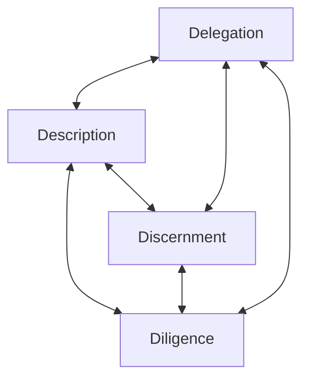

# reviewer
Agentic reviewer for tech products using: Wirecutter, RTINGS, Reddit, and Amazon

---

## Collaboration Framework (4 D's)

### Delegation

| Owner | Responsibilities |
|---|---|
| **AI** | Web research across Wirecutter, RTINGS, Reddit, and Amazon; source aggregation; rubric scoring; quote extraction; structured formatting of the review. |
| **Neil** | Product selection, use case context, budget tier, any cross-shop comparisons. Final purchase decision stays with you — always. |
| **Collaborative** | If a rating feels off or a source seems thin, we iterate together until the analysis holds. |

---

### Description
Just give me a product name. I'll handle the rest — sourcing, context, and structuring the review against the rubric.

---

### Discernment
Your job is to read the review critically, not accept it as final. Specifically: verify that quotes read in context, check that STRONG ratings are backed by concrete reasoning, and flag if a source feels thin or a score seems inflated. Push back freely — that's the loop working.

---

### Diligence
**My commitments:** actual quotes (never paraphrased), honest `[NO DATA]` flags, no inflated ratings without evidence, no fabricated sources.

**Your commitment:** treat the review as informed input, not a final answer. High-stakes purchases warrant your own verification before acting.
